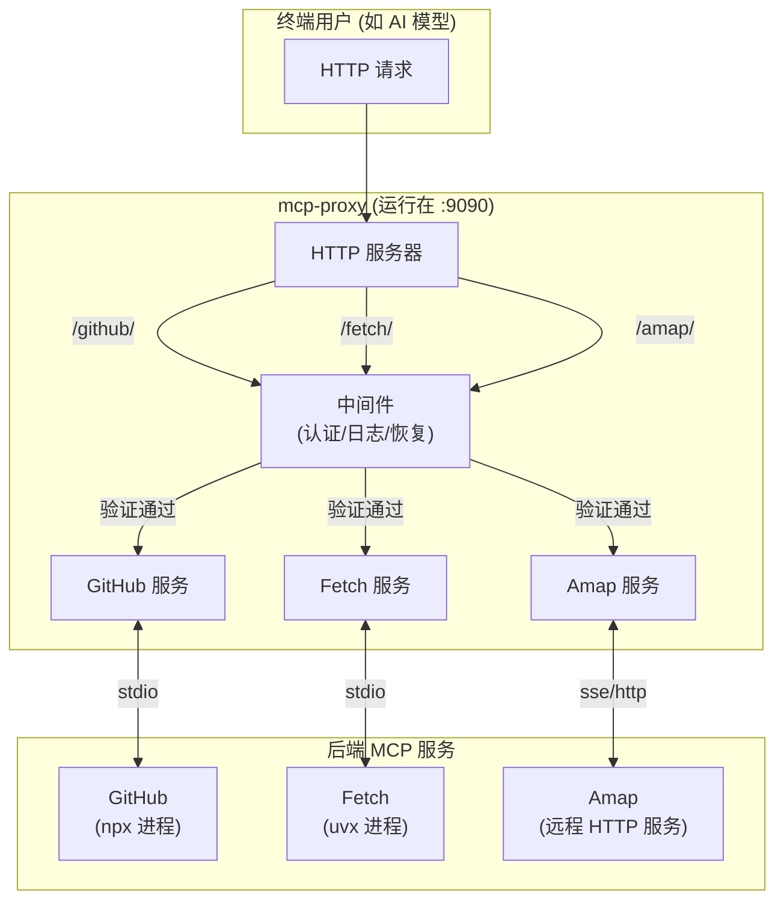

# mcp-proxy 学习指南

欢迎来到 `mcp-proxy` 项目的学习指南！本指南将带你从零开始，一步步深入了解项目的各个方面，最终使你能够熟练使用、扩展甚至为项目贡献代码。

我们将分阶段进行学习：

1.  **第一阶段：初识与上手** - 了解项目是做什么的，并成功运行它。
2.  **第二阶段：核心概念与配置** - 深入理解项目的核心架构和配置文件中每个字段的含义。
3.  **第三阶段：代码模块探索** - 逐一探索项目的 Go 源代码文件，理解其内部工作原理。
4.  **第四阶段：成为贡献者** - 了解如何为项目做出贡献。

---

## 第一阶段：初识与上手

### 1.1 项目是做什么的？

首先，请阅读我们为您准备的 [快速入门 (`quickstart.md`)](./quickstart.md)。

读完后，你应该明白 `mcp-proxy` 是一个"MCP 网关"，它可以帮你：
*   同时管理多个 AI 功能提供方（我们称之为"后端"）。
*   通过一个统一的地址来使用这些功能。
*   为这些功能增加统一的认证、日志和过滤规则。

### 1.2 跑起来！

理论结合实践是最好的学习方式。让我们先让项目在你的本地机器上运行起来。

**选项 A: 使用 Go 直接运行**
1.  确保你已经安装了 Go 语言环境。
2.  克隆项目代码：`git clone https://github.com/TBXark/mcp-proxy.git`
3.  进入项目目录：`cd mcp-proxy`
4.  项目自带一个 `config.json` 示例文件，我们直接用它来启动：`go run .`
5.  当你看到类似 `Starting SSE server listening on :9090` 和 `All clients initialized` 的日志时，恭喜你，代理服务器已经成功运行了！

**选项 B: 使用 Docker 运行**
1.  确保你已经安装了 Docker 和 Docker Compose。
2.  在项目根目录下，直接运行：`docker-compose up`
3.  Docker 会自动构建镜像并启动容器。

现在，代理服务器正在监听 `9090` 端口，并代理了 `config.json` 中定义的 `github`, `fetch`, `amap` 等服务。

---

## 第二阶段：核心概念与配置

在这一阶段，我们将深入理解 `mcp-proxy` 的核心组件以及如何通过 `config.json` 定制它的行为。

### 2.1 核心架构

这个项目的架构可以用一张图来简单说明：

*   **HTTP 服务器**: 负责接收所有传入的请求。
*   **中间件**: 在请求到达真正的业务逻辑前执行，负责认证、日志等通用功能。
*   **MCP 服务**: 代理内部为每个后端服务创建的"虚拟服务"。
*   **后端 MCP 服务**: 真正提供 AI 功能的服务，可以是本地命令或远程服务器。

### 2.2 配置详解

现在，请打开 `config.json` 文件。我们来逐一分析每个字段。请对照阅读 `README.md` 中的 [Configuration](https://github.com/TBXark/mcp-proxy#configuration) 部分和 `quickstart.md` 中的配置说明。

**你需要重点理解**:
*   `mcpProxy` 和 `mcpServers` 的区别：前者是全局配置，后者是针对每个后端服务的独立配置。
*   三种后端类型：`stdio`, `sse`, `streamable-http`，以及它们分别需要哪些字段（如 `command` vs `url`）。
*   `options` 的继承关系：`mcpServers` 中的 `options` 会覆盖 `mcpProxy` 中的同名 `options`。
*   `toolFilter` 的工作方式：黑名单 (`block`) 和白名单 (`allow`) 模式的区别。

**动手练习**:
1.  尝试修改 `config.json`，将 `fetch` 服务的日志打开 (`"logEnabled": true`)。
2.  为 `amap` 服务添加一个 `authTokens`，然后尝试用 `curl` 或 Postman 等工具访问 `http://localhost:9090/amap/`，看看是否能看到未授权的错误。
3.  在 `github` 服务中，添加一个 `toolFilter` 来屏蔽掉某个工具。你可以先不加 `toolFilter` 运行一次，从日志中找到工具名，然后再添加过滤。

---

## 第三阶段：代码模块探索

是时候深入代码了！我们将按照程序的执行顺序来探索代码。

### 3.1 入口: `main.go`
这是程序的起点。代码很简单，主要做三件事：
1.  解析命令行参数 (`-config`, `-version`, `-help`)。
2.  调用 `load()` 函数加载配置。
3.  调用 `startHTTPServer()` 启动服务。

### 3.2 配置加载: `config.go`
这个文件定义了 `config.json` 中所有字段对应的 Go 结构体。
*   **核心函数**: `load(path string)`。
*   **亮点**: 这个函数负责从文件或URL加载配置，并设置合理的默认值，使得配置管理更加灵活。

### 3.3 HTTP 服务: `http.go`
这是项目的"骨架"。
*   **核心函数**: `startHTTPServer(config *Config)`。
*   **学习重点**:
    *   **循环与并发**: 注意 `for name, clientConfig := range config.McpServers` 这个循环。它为每个后端服务启动了一个 goroutine (`errorGroup.Go(...)`) 来进行初始化。
    *   **中间件链**: 理解 `chainMiddleware` 和 `newAuthMiddleware`, `loggerMiddleware`, `recoverMiddleware` 的实现。这是 Go Web 开发中非常常见的模式。
    *   **路由注册**: `httpMux.Handle(mcpRoute, ...)` 是如何将不同的 URL 路径映射到不同服务的处理逻辑上的。
    *   **优雅停机**: 文件末尾的 `signal.Notify` 和 `httpServer.Shutdown` 是如何保证在程序退出时，能处理完正在进行的请求，而不是粗暴地中断它们。

### 3.4 客户端与适配器: `client.go`
这是项目的"血肉"，是连接代理和真实后端的关键。
*   **核心函数**: `newMCPClient`, `addToMCPServer`。
*   **学习重点**:
    *   **工厂模式**: `newMCPClient` 函数是一个典型的工厂模式。它根据配置中的不同类型，返回不同实现的 `mcp-go` 客户端。
    *   **代理核心逻辑 `addToMCPServer`**: 这是最重要的方法！仔细阅读它的步骤：
        1.  初始化 MCP 连接 (`client.Initialize`)。
        2.  从后端获取能力列表（`client.ListTools`, `client.ListPrompts` 等）。
        3.  将这些能力添加到代理的 `mcpServer` 上 (`mcpServer.AddTool`, `mcpServer.AddPrompt`)。
        4.  **注意 `mcpServer.AddTool` 的第二个参数**: 传入的是 `c.client.CallTool`。这意味着，当代理的 `MCPServer` 收到一个工具调用请求时，它会回调这个函数，最终通过 `c.client` 将请求转发给真正的后端服务。**这就是代理功能的核心实现**。
        5.  **工具过滤的实现**: `filterFunc` 的逻辑在这里被应用，决定了哪些工具最终能被添加到 `mcpServer`。

---

## 第四阶段：成为贡献者

当你对项目有了深入的了解后，欢迎为社区做出贡献！

*   **报告问题**: 如果发现 Bug 或者有功能建议，欢迎在 GitHub Issues 中提出。
*   **贡献代码**:
    1.  Fork 项目到你自己的 GitHub 账号。
    2.  在本地创建新的分支 (`git checkout -b my-new-feature`)。
    3.  进行修改并提交 (`git commit -am 'Add some feature'`)。
    4.  将你的分支推送到 GitHub (`git push origin my-new-feature`)。
    5.  创建一个 Pull Request。

希望这份指南能帮助你更好地学习 `mcp-proxy` 项目！ 